# Masked Generative Video-to-Audio Transformers with Enhanced Synchronicity

This is the demonstration page of the paper "Masked Generative Video-to-Audio Transformers with Enhanced Synchronicity" with some selected samples generated with the proposed method.

## Info

### Abstract

Video-to-audio (V2A) generation leverages visual-only video features to render plausible sounds that match the scene. Importantly, the generated sound onsets should match the visual actions that are aligned with them, otherwise unnatural synchronization artifacts arise. Recent works have explored the progression of conditioning sound generators on still images and then video features, focusing on quality and semantic matching while ignoring synchronization, or by sacrificing some amount of quality to focus on improving synchronization only. In this work, we propose a V2A generative model, named MaskVAT, that interconnects a full-band high-quality general audio codec with a sequence-to-sequence masked generative model. This combination allows modeling both high audio quality, semantic matching, and temporal synchronicity at the same time. Our results show that, by combining a high-quality codec with the proper pre-trained audio-visual features and a sequence-to-sequence parallel structure, we are able to yield highly synchronized results on one hand, whilst being competitive with the state of the art of non-codec generative audio models.

### Reference

**Masked Generative Video-to-Audio Transformers with Enhanced Synchronicity**.  
S. Pascual, C. Yeh, I. Tsiamas, & J. Serrà.  
The 18th European Conference on Computer Vision ECCV 2024.  
[Arxiv: 2407.10387](https://arxiv.org/abs/2407.10387)

## Qualitative Results

### MaskVAT Showcase

<html>
<table>
  <tr> 
    <td>
        <video width="320" height="240" controls>
        <source src="videos/typewriter.mp4">
        </video>
        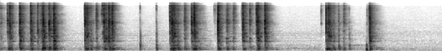
    </td>
    <td>
        <video width="320" height="240" controls>
        <source src="videos/seashore.mp4">
        </video>
        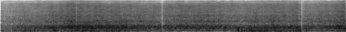
    </td>
    <td>
        <video width="320" height="240" controls>
        <source src="videos/train.mp4">
        </video>
        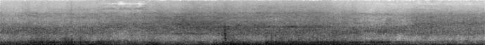
    </td>
  </tr>

  <tr> 
    <td>
        <video width="320" height="240" controls>
        <source src="videos/chew.mp4">
        </video>
        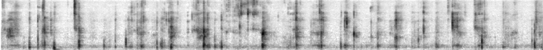
    </td>
    <td>
        <video width="320" height="240" controls>
        <source src="videos/cello.mp4">
        </video>
        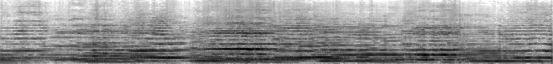
    </td>
    <td>
        <video width="320" height="240" controls>
        <source src="videos/pipa.mp4">
        </video>
        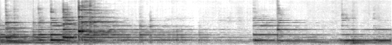
    </td>
  </tr>

  <tr> 
    <td>
        <video width="320" height="240" controls>
        <source src="videos/guitar.mp4">
        </video>
        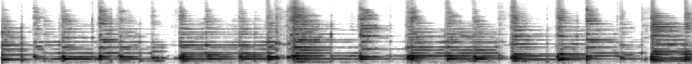
    </td>
    <td>
        <video width="320" height="240" controls>
        <source src="videos/conga.mp4">
        </video>
        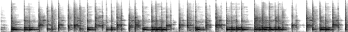
    </td>
    <td>
        <video width="320" height="240" controls>
        <source src="videos/xylo.mp4">
        </video>
        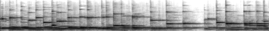
    </td>
  </tr>

  <tr>
    <td>
        <video width="320" height="240" controls>
        <source src="videos/sora_shipscoffee.mp4">
        </video>
        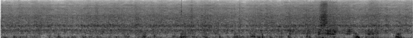
    </td>
    <td>
        <video width="320" height="240" controls>
        <source src="videos/sora_kangaroo.mp4">
        </video>
        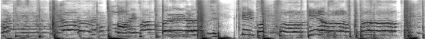
    </td>
    <td>
        <video width="320" height="240" controls>
        <source src="videos/sora_suv.mp4">
        </video>
        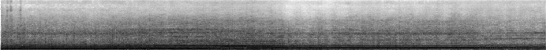
    </td>
  </tr>

</table>
</html>

### Comparison With Prior Works

<html>
<table>
  <tr>
    <td>
      Ground Truth
    </td>
    <td>
      MaskVAT
    </td>
    <td>
      Diff-Foley
    </td>
    <td>
      V2A-Mapper
    </td>
  </tr>
  <tr>
    <td>
        <video width="320" height="240" controls>
        <source src="videos/ice_gt.mp4">
        </video>
        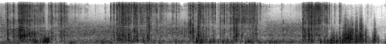
    </td>
    <td>
        <video width="320" height="240" controls>
        <source src="videos/ice_maskvat.mp4">
        </video>
        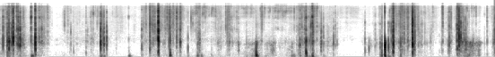
    </td>
    <td>
        <video width="320" height="240" controls>
        <source src="videos/ice_dfoley.mp4">
        </video>
        
    </td>
    <td>
        <video width="320" height="240" controls>
        <source src="videos/ice_v2a.mp4">
        </video>
        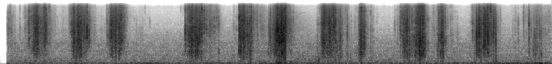
    </td>
  </tr>
  <tr>
    <td>
        <video width="320" height="240" controls>
        <source src="videos/drums_gt.mp4">
        </video>
        
    </td>
    <td>
        <video width="320" height="240" controls>
        <source src="videos/drums_maskvat.mp4">
        </video>
        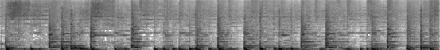
    </td>
    <td>
        <video width="320" height="240" controls>
        <source src="videos/drums_dfoley.mp4">
        </video>
              
    </td>
    <td>
        <video width="320" height="240" controls>
        <source src="videos/drums_v2a.mp4">
        </video>
        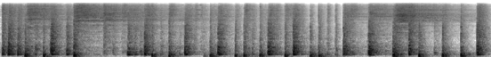      
    </td>
  </tr>
  <tr>
    <td>
        <video width="320" height="240" controls>
        <source src="videos/lion_gt.mp4">
        </video>
        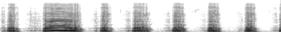
    </td>
    <td>
        <video width="320" height="240" controls>
        <source src="videos/lion_maskvat.mp4">
        </video>
        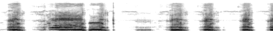
    </td>
    <td>
        <video width="320" height="240" controls>
        <source src="videos/lion_dfoley.mp4">
        </video>
        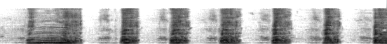
    </td>
    <td>
        <video width="320" height="240" controls>
        <source src="videos/lion_v2a.mp4">
        </video>
        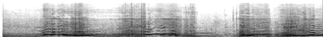
    </td>
  </tr>
  <tr>
    <td>
        <video width="320" height="240" controls>
        <source src="videos/tennis_gt.mp4">
        </video>
        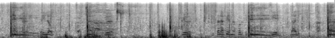
    </td>
    <td>
        <video width="320" height="240" controls>
        <source src="videos/tennis_maskvat.mp4">
        </video>
        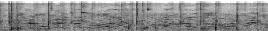
    </td>
    <td>
        <video width="320" height="240" controls>
        <source src="videos/tennis_dfoley.mp4">
        </video>
        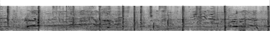
    </td>
    <td>
        <video width="320" height="240" controls>
        <source src="videos/tennis_v2a.mp4">
        </video>
        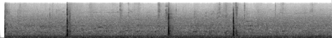
    </td>
  </tr>
  <tr>
    <td>
        <video width="320" height="240" controls>
        <source src="videos/erhu_gt.mp4">
        </video>
        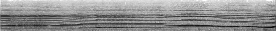
    </td>
    <td>
        <video width="320" height="240" controls>
        <source src="videos/erhu_maskvat.mp4">
        </video>
        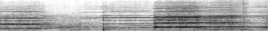      
    </td>
    <td>
        <video width="320" height="240" controls>
        <source src="videos/erhu_dfoley.mp4">
        </video>
        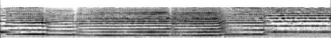
    </td>
    <td>
        <video width="320" height="240" controls>
        <source src="videos/erhu_v2a.mp4">
        </video>
        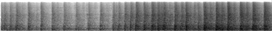
    </td>
  </tr>
</table>
</html>

### Other References

- Luo, S., Yan, C., Hu, C., Zhao, H.: Diff-foley: Synchronized video-to-audio synthesis with latent diffusion models. Advances in Neural Information Processing Systems 36 (2024) [https://diff-foley.github.io](https://diff-foley.github.io)
- Wang, H., Ma, J., Pascual, S., Cartwright, R., Cai, W.: V2a-mapper: A lightweight solution for vision-to-audio generation by connecting foundation models. arXiv preprint arXiv:2308.09300 (2023) [https://v2a-mapper.github.io](https://v2a-mapper.github.io)
- Sora generated videos from OpenAI (2024) [https://openai.com/index/sora/](https://openai.com/index/sora/)

