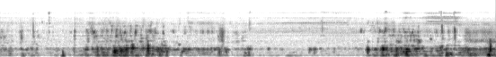
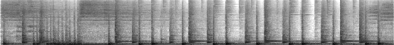
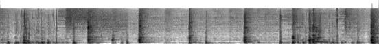

# Masked Generative Video-to-Audio Transformers with Enhanced Synchronicity

## Qualitative Results

### MaskVAT Showcase

<html>
<table>
  <tr> 
    <td>
        <video width="320" height="240" controls>
        <source src="videos/typewriter.mp4">
        </video>
        
    </td>
    <td>
        <video width="320" height="240" controls>
        <source src="videos/seashore.mp4">
        </video>
        
    </td>
    <td>
        <video width="320" height="240" controls>
        <source src="videos/train.mp4">
        </video>
        
    </td>
  </tr>

  <tr> 
    <td>
        <video width="320" height="240" controls>
        <source src="videos/chew.mp4">
        </video>
        
    </td>
    <td>
        <video width="320" height="240" controls>
        <source src="videos/cello.mp4">
        </video>
        
    </td>
    <td>
        <video width="320" height="240" controls>
        <source src="videos/pipa.mp4">
        </video>
        
    </td>
  </tr>

  <tr> 
    <td>
        <video width="320" height="240" controls>
        <source src="videos/guitar.mp4">
        </video>
        
    </td>
    <td>
        <video width="320" height="240" controls>
        <source src="videos/conga.mp4">
        </video>
        
    </td>
    <td>
        <video width="320" height="240" controls>
        <source src="videos/xylo.mp4">
        </video>
        
    </td>
  </tr>

  <tr>
    <td>
        <video width="320" height="240" controls>
        <source src="videos/sora_shipscoffee.mp4">
        </video>
        
    </td>
    <td>
        <video width="320" height="240" controls>
        <source src="videos/sora_kangaroo.mp4">
        </video>
        
    </td>
    <td>
        <video width="320" height="240" controls>
        <source src="videos/sora_suv.mp4">
        </video>
        
    </td>
  </tr>

</table>
</html>

### Comparison With Prior Works

<html>
<table>
  <tr>
    <td>
      Ground Truth
    </td>
    <td>
      MaskVAT
    </td>
    <td>
      Diff-Foley
    </td>
    <td>
      V2A-Mapper
    </td>
  </tr>
  <tr>
    <td>
        <video width="320" height="240" controls>
        <source src="videos/ice_gt.mp4">
        </video>
        
    </td>
    <td>
        <video width="320" height="240" controls>
        <source src="videos/ice_maskvat.mp4">
        </video>
        
    </td>
    <td>
        <video width="320" height="240" controls>
        <source src="videos/ice_dfoley.mp4">
        </video>
        
    </td>
    <td>
        <video width="320" height="240" controls>
        <source src="videos/ice_v2a.mp4">
        </video>
        
    </td>
  </tr>
  <tr>
    <td>
        <video width="320" height="240" controls>
        <source src="videos/drums_gt.mp4">
        </video>
        
    </td>
    <td>
        <video width="320" height="240" controls>
        <source src="videos/drums_maskvat.mp4">
        </video>
        
    </td>
    <td>
        <video width="320" height="240" controls>
        <source src="videos/drums_dfoley.mp4">
        </video>
              
    </td>
    <td>
        <video width="320" height="240" controls>
        <source src="videos/drums_v2a.mp4">
        </video>
              
    </td>
  </tr>
  <tr>
    <td>
        <video width="320" height="240" controls>
        <source src="videos/lion_gt.mp4">
        </video>
        
    </td>
    <td>
        <video width="320" height="240" controls>
        <source src="videos/lion_maskvat.mp4">
        </video>
        
    </td>
    <td>
        <video width="320" height="240" controls>
        <source src="videos/lion_dfoley.mp4">
        </video>
        
    </td>
    <td>
        <video width="320" height="240" controls>
        <source src="videos/lion_v2a.mp4">
        </video>
        
    </td>
  </tr>
  <tr>
    <td>
        <video width="320" height="240" controls>
        <source src="videos/tennis_gt.mp4">
        </video>
        
    </td>
    <td>
        <video width="320" height="240" controls>
        <source src="videos/tennis_maskvat.mp4">
        </video>
        
    </td>
    <td>
        <video width="320" height="240" controls>
        <source src="videos/tennis_dfoley.mp4">
        </video>
        
    </td>
    <td>
        <video width="320" height="240" controls>
        <source src="videos/tennis_v2a.mp4">
        </video>
        
    </td>
  </tr>
  <tr>
    <td>
        <video width="320" height="240" controls>
        <source src="videos/erhu_gt.mp4">
        </video>
        
    </td>
    <td>
        <video width="320" height="240" controls>
        <source src="videos/erhu_maskvat.mp4">
        </video>
              
    </td>
    <td>
        <video width="320" height="240" controls>
        <source src="videos/erhu_dfoley.mp4">
        </video>
        
    </td>
    <td>
        <video width="320" height="240" controls>
        <source src="videos/erhu_v2a.mp4">
        </video>
        
    </td>
  </tr>
</table>
</html>

### Reference

- Luo, S., Yan, C., Hu, C., Zhao, H.: Diff-foley: Synchronized video-to-audio synthesis with latent diffusion models. Advances in Neural Information Processing Systems 36 (2024) [https://diff-foley.github.io](https://diff-foley.github.io)
- Wang, H., Ma, J., Pascual, S., Cartwright, R., Cai, W.: V2a-mapper: A lightweight solution for vision-to-audio generation by connecting foundation models. arXiv preprint arXiv:2308.09300 (2023) [https://v2a-mapper.github.io](https://v2a-mapper.github.io)

